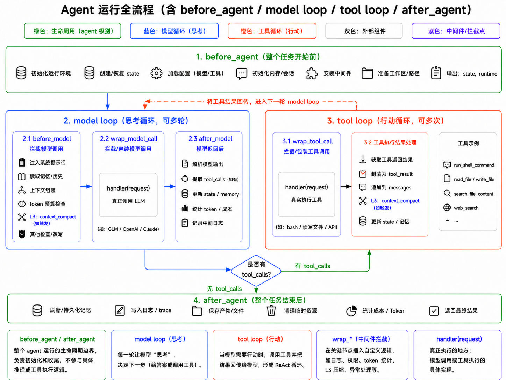

# Agent Middleware 运行流程说明

本文说明 `create_agent` 中 middleware 的运行位置、数据格式，以及它们在 `xu-agent` 项目中的用途。



## 总览

LangChain 的 `create_agent` 会把一次用户请求组织成一个可循环执行的 agent 图。整体流程可以分为四段：

1. `before_agent`：整个任务开始前执行一次。
2. `model loop`：调用模型进行推理，可重复多轮。
3. `tool loop`：模型请求工具调用时执行工具，可重复多轮。
4. `after_agent`：整个任务结束后执行一次。

middleware 是插入这些阶段的拦截层。它可以读取状态、改写模型请求、审批工具调用、记录日志、处理异常、更新 graph state 等。

## 当前项目中的 middleware

`xu-agent` 在 `backend/src/agent.py` 中配置 middleware：

```python
middleware = [
    AgentRecoveryMiddleware(),
    AgentMemoryMiddleware(),
    AgentContextCompactMiddleware(),
    AgentPermissionMiddleware(),
]

if is_agent_logging_enabled():
    middleware.append(AgentLoggingMiddleware())
```

## Agent 生命周期

### before_agent

`before_agent` 在整个 agent 任务开始前执行一次。

签名：

```python
def before_agent(self, state, runtime) -> dict[str, Any] | None:
    ...
```

常见用途：

- 初始化运行环境。
- 恢复或创建 state。
- 加载配置。
- 初始化内存、会话、工作目录。
- 记录任务开始日志。

数据格式：

```python
state = {
    "messages": [...],
    "context_usage": {...},
    # 其他自定义 state 字段
}
```

返回 `None` 表示不更新 state；返回字典表示把字段合并回 graph state。

### after_agent

`after_agent` 在整个 agent 任务结束后执行一次。

签名：

```python
def after_agent(self, state, runtime) -> dict[str, Any] | None:
    ...
```

常见用途：

- 写入最终日志或 trace。
- 持久化记忆。
- 保存产物或文件。
- 清理临时资源。
- 统计本轮成本和 token。
- 返回最终状态补充字段。

它不参与具体模型推理，也不直接执行工具，更多用于收尾。

## Model Loop

model loop 是 agent 的“思考循环”。每一轮模型会读取当前 `messages`、`system_message`、tools schema 等内容，然后决定：

- 直接回答用户。
- 或发起一个或多个 tool calls。

如果模型产生 tool calls，流程会进入 tool loop。工具结果返回后，再进入下一轮 model loop。

### before_model

`before_model` 在每次模型调用前执行。

签名：

```python
def before_model(self, state, runtime) -> dict[str, Any] | None:
    ...
```

它拿到的是 graph state，而不是完整的模型请求对象。适合做轻量 state 更新，例如：

- 检查上下文长度。
- 标记即将压缩。
- 写入临时状态。
- 根据 state 决定是否准备进入压缩流程。

如果需要修改真正送给模型的 `messages`、`system_message`、`tools` 或 `model_settings`，通常应使用 `wrap_model_call`。

### wrap_model_call

`wrap_model_call` 是模型调用的核心拦截点。

签名：

```python
def wrap_model_call(self, request, handler):
    response = handler(request)
    return response
```

`request` 是 `ModelRequest`，主要字段如下：

```python
request.model           # 当前模型实例
request.messages        # 当前要发送给模型的消息列表
request.system_message  # 系统提示词
request.tools           # 可用工具 schema
request.tool_choice     # 工具选择策略
request.response_format # 结构化输出格式
request.state           # 当前 graph state
request.runtime         # 运行时上下文
request.model_settings  # 模型参数
```

真正调用模型的位置是：

```python
response = handler(request)
```

如果要改写请求，应使用：

```python
request = request.override(
    messages=new_messages,
    system_message=new_system_message,
)
```

常见用途：

- 注入 memory。
- 裁剪或压缩历史消息。
- 切换模型。
- 修改 `model_settings`。
- 统计真实 token usage。
- 捕获模型异常并重试。
- 将模型响应中的信息写回 state。

当前项目中的例子：

- `AgentMemoryMiddleware` 在这里注入记忆。
- `AgentRecoveryMiddleware` 在这里做模型重试。
- `AgentContextCompactMiddleware` 在这里读取 `response.usage_metadata` 并写入 `context_usage`。

### after_model

`after_model` 在每次模型调用后执行。

签名：

```python
def after_model(self, state, runtime) -> dict[str, Any] | None:
    ...
```

它看到的是模型调用后的 graph state，适合做：

- 解析模型输出后的状态检查。
- 记录中间日志。
- 更新统计字段。
- 准备进入下一轮 tool loop 或结束流程。

如果需要直接读取 `ModelResponse`，更适合使用 `wrap_model_call`。

## Tool Loop

tool loop 是 agent 的“行动循环”。当模型返回 tool calls 后，LangGraph 会执行对应工具，并把工具结果作为 tool message 加回 `messages`，然后回到 model loop。

### wrap_tool_call

`wrap_tool_call` 是工具调用的核心拦截点。

签名：

```python
def wrap_tool_call(self, request, handler):
    result = handler(request)
    return result
```

`request` 是 `ToolCallRequest`，主要字段如下：

```python
request.tool_call  # 模型发出的工具调用
request.tool       # 注册后的工具对象
request.state      # 当前 graph state
request.runtime    # 工具运行时上下文
```

`request.tool_call` 通常类似：

```python
{
    "name": "run_shell_command",
    "args": {
        "command": "python --version",
        "cwd": "D:\\ai\\xu-agent",
        "shell": "powershell",
    },
    "id": "toolu_xxx",
    "type": "tool_call",
}
```

真正执行工具的位置是：

```python
result = handler(request)
```

如果要改写工具参数，应使用：

```python
request = request.override(
    tool_call={
        **request.tool_call,
        "args": new_args,
    }
)
```

常见用途：

- 权限审批。
- 阻止危险命令。
- 修改工具参数。
- 注入 thread id 或运行上下文。
- 记录工具调用日志。
- 对工具结果做截断或脱敏。

当前项目中的例子：

- `AgentPermissionMiddleware` 在工具执行前检查 `run_shell_command`、`write_file`、`edit_file` 等操作是否需要审批。
- `AgentLoggingMiddleware` 记录 `tool.start`、`tool.end` 和 `tool.error`。

## handler(request) 的含义

图中多次出现 `handler(request)`。它表示“继续执行原本应该执行的事情”。

在 `wrap_model_call` 中：

```python
handler(request)
```

表示真正调用 LLM。

在 `wrap_tool_call` 中：

```python
handler(request)
```

表示真正执行工具。

middleware 可以选择：

- 在 `handler(request)` 前做前置处理。
- 在 `handler(request)` 后处理结果。
- 捕获异常并重试。
- 不调用 `handler(request)`，直接返回拒绝或替代结果。

## 上下文压缩的位置

上下文压缩一般放在 model loop 附近，因为它影响的是模型输入。

可选位置：

- `before_model`：根据 state 判断是否需要压缩，并返回更新后的 state。
- `wrap_model_call`：直接改写 `request.messages` 或 `request.system_message`。

当前项目的 `AgentContextCompactMiddleware` 暂时没有真正压缩，只做上下文 token 统计。后续如果实现压缩，建议遵循：

1. 使用真实 `context_usage.input_tokens` 或模型 token counter 判断是否超过阈值。
2. 保留最近若干轮消息。
3. 对更早消息生成摘要。
4. 避免拆散 `AIMessage.tool_calls` 和对应 `ToolMessage`。
5. 把压缩摘要作为明确的 system/human 上下文注入。

## 小结

middleware 是 agent 的关键扩展点：

- `before_agent / after_agent` 负责整个任务生命周期。
- `before_model / after_model` 负责每轮模型调用前后的 state 处理。
- `wrap_model_call` 负责拦截和改写模型请求，是记忆、压缩、重试、统计的主要位置。
- `wrap_tool_call` 负责拦截工具调用，是权限审批、安全控制、工具日志的主要位置。

理解这些 hook 的位置，就能清楚判断某个能力应该放在哪里：影响模型输入的放 model loop，影响工具执行的放 tool loop，初始化和收尾放 agent 生命周期。
